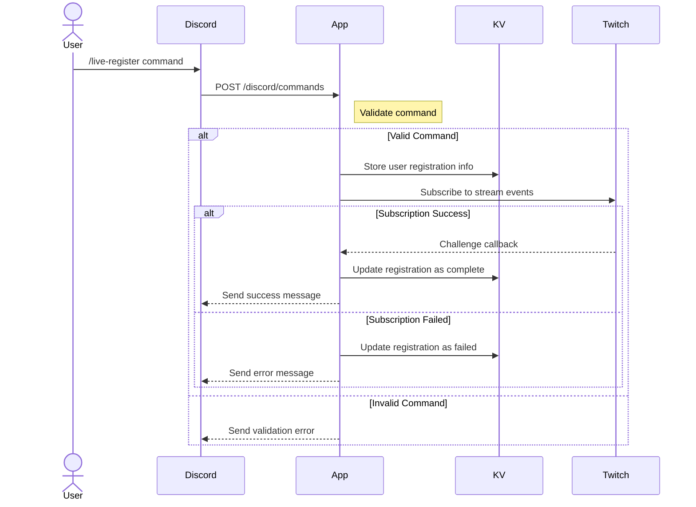
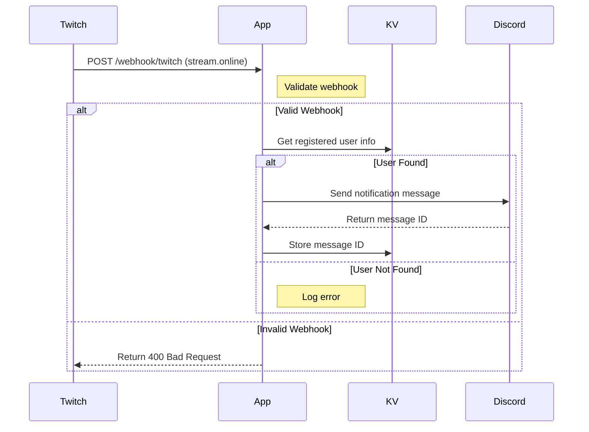

# Live-Noti-Fire

## Sequence Diagrams

### 1. Initial Registration Flow


### 2. Stream Start Flow


### 3. Stream End Flow
```mermaid
sequenceDiagram
    participant Twitch
    participant App
    participant KV
    participant Discord

    Twitch->>App: POST /webhook/twitch (stream.offline)
    Note right of App: Validate webhook

    alt Valid Webhook
        App->>KV: Get message ID & user info

        alt Found Message ID
            App->>Discord: Add end-stream reaction
            alt Reaction Success
                Note right of App: Complete
            else Reaction Failed
                Note right of App: Log error
            end
        else Not Found
            Note right of App: Log error
        end

    else Invalid Webhook
        App-->>Twitch: Return 400 Bad Request
    end
