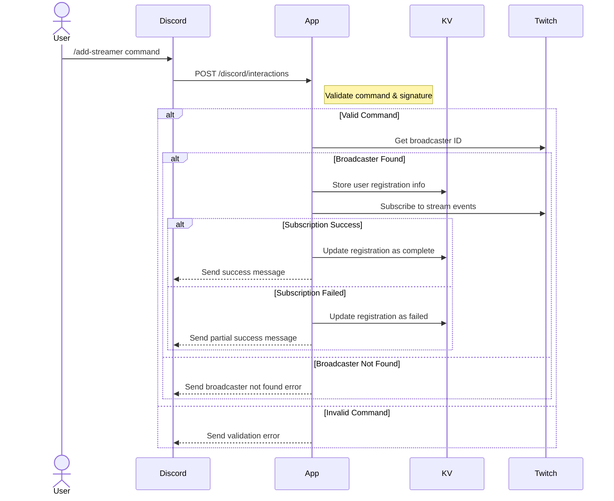

# Live-Noti-Fire

Twitchの配信開始/終了をDiscordで通知するBotです。

## Features

- サーバーへのBot追加時に自動でコマンドを登録
- `/add-streamer` コマンドでTwitchアカウントとDiscordアカウントを連携
- `/notify-settings` コマンドで通知チャンネルと通知ルールを設定
- 配信開始時に自動で通知メッセージを送信
- 配信終了時にメッセージにリアクションを追加

## Setup

### Prerequisites

- [Deno](https://deno.land/) 1.37 or later
- Discord Bot Application
- Twitch Developer Application

### Discord Bot Setup

1. [Discord Developer Portal](https://discord.com/developers/applications)でアプリケーションを作成

2. Botの設定
- 「Bot」タブで以下の設定を有効化：
  - `Presence Intent` 
  - `Server Members Intent`
  - `Message Content Intent`

3. Botをサーバーに追加
```
https://discord.com/oauth2/authorize?client_id=1353969216751013919&permissions=2147485760&integration_type=0&scope=bot
```

このURLにアクセスして、Botを追加したいDiscordサーバーを選択してください。
Botの追加時に自動的にスラッシュコマンドが登録されます。

必要な権限:
- メッセージの送信
- メッセージへのリアクション追加

### Twitch Setup

1. [Twitch Developer Console](https://dev.twitch.tv/console)でアプリケーションを作成
2. Client IDとClient Secretを取得

### 環境変数の設定

1. .envファイルの作成
```bash
cp .env.example .env
```

2. .envファイルを編集
```env
# Discord
DISCORD_CLIENT_ID="your-discord-client-id"
DISCORD_CLIENT_SECRET="your-discord-bot-token"

# Twitch
TWITCH_CLIENT_ID="your-twitch-client-id"
TWITCH_CLIENT_SECRET="your-twitch-client-secret"
```

注意：
- ローカル開発時は.envファイルから環境変数が読み込まれます
- 本番環境では`Deno.env`から環境変数を読み込みます
- .envファイルはGitリポジトリにコミットしないでください

### Development

1. リポジトリのクローン
```bash
git clone https://github.com/YourUsername/live-noti-fire.git
cd live-noti-fire
```

2. 環境変数の設定
```bash
cp .env.example .env
# .envファイルを編集して必要な値を設定
```

3. 開発サーバーの起動
```bash
deno task dev
```

## Available Commands
### /add-streamer

Twitchアカウントの配信通知を登録します。

```
/add-streamer twitch_username:あなたのTwitchユーザー名
```

### /notify-settings

配信通知の設定を行います。

```
/notify-settings channel:通知を送信するチャンネル rules:通知ルール（オプション）
```

- `channel`: 通知を送信するDiscordチャンネル（必須）
- `rules`: 通知ルール（カンマ区切りで複数指定可、オプション）


## API Endpoints

### Discord Endpoints
```
POST /discord/interactions
```
Discordのスラッシュコマンドやインタラクションを受け付けます。

```
POST /discord/command_register
```
スラッシュコマンドを登録します。

### Twitch Endpoint
```
POST /twitch/webhooks
```
Twitchからのウェブフックを受け付けます。

### Debug Endpoints
```
GET /debug/kv
```
KVストアの現在の状態を確認します。

```
DELETE /debug/kv
```
KVストアの内容を全てクリアします。

```
POST /debug/kv/delete
```
KVストアから特定のエントリを削除します。

### Health Endpoint
```
GET /health
```
サーバーの稼働状態を確認します。

## 補足情報

### スラッシュコマンドの手動登録

通常は不要ですが、必要な場合は以下のコマンドで手動登録が可能です：

```bash
deno task register-commands
```

## Sequence Diagrams

### 1. Initial Registration Flow


### 2. Stream Start Flow


### 3. Stream End Flow
```mermaid
sequenceDiagram
    participant Twitch
    participant App
    participant KV
    participant Discord

    Twitch->>App: POST /twitch/webhooks (stream.offline)
    Note right of App: Validate webhook

    alt Valid Webhook
        App->>KV: Get message ID & user info

        alt Found Message ID
            App->>Discord: Add end-stream reaction
            alt Reaction Success
                Note right of App: Complete
            else Reaction Failed
                Note right of App: Log error
            end
        else Not Found
            Note right of App: Log error
        end

    else Invalid Webhook
        App-->>Twitch: Return 400 Bad Request
    end
