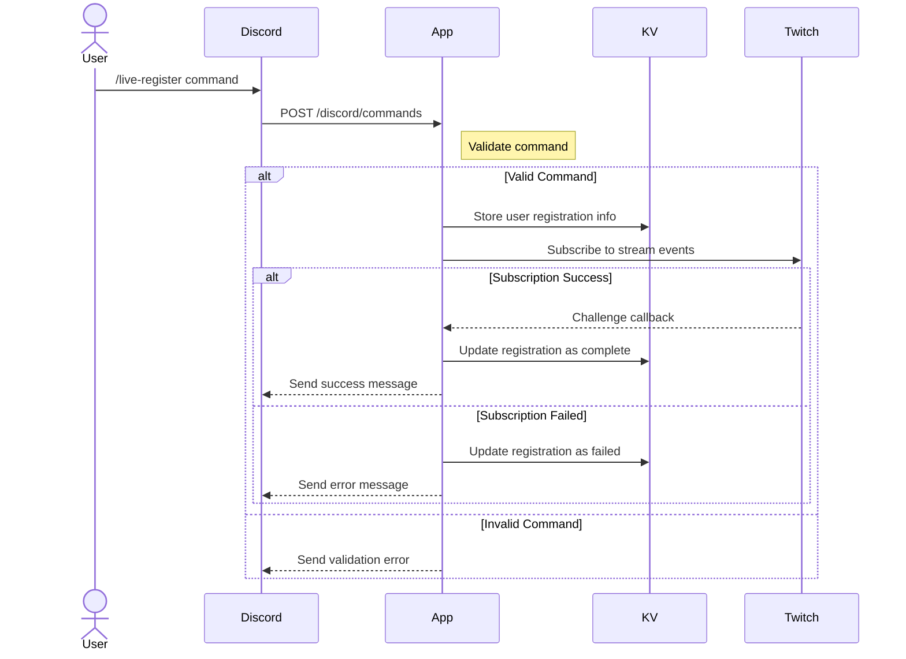
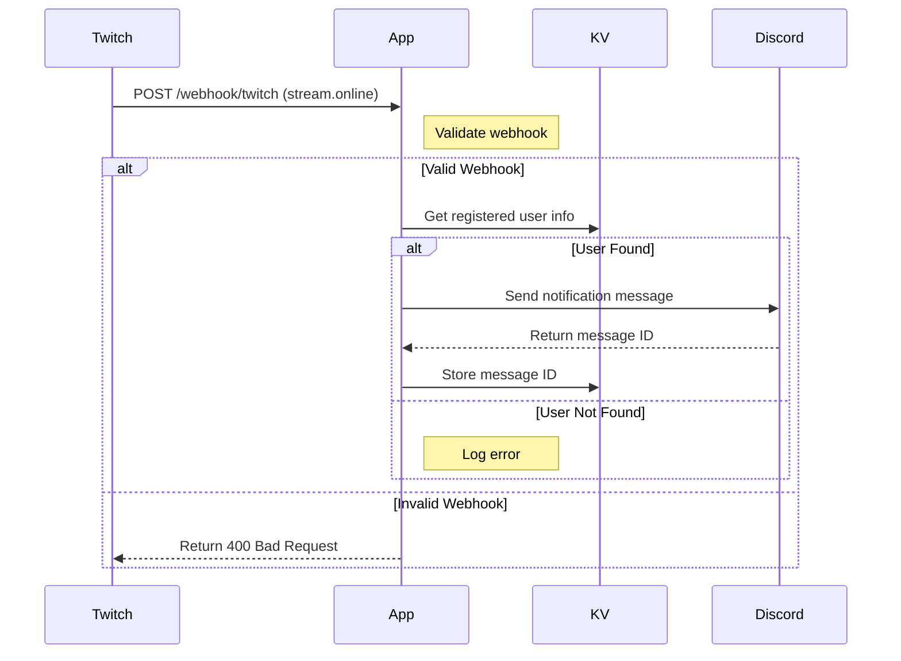

# Live-Noti-Fire

Twitchの配信開始/終了をDiscordで通知するBotです。

## Features

- OAuth2による安全なBot認証とセットアップ
- `/live-register` コマンドでTwitchアカウントとDiscordアカウントを連携
- 配信開始時に自動で通知メッセージを送信
- 配信終了時にメッセージにリアクション追加

## Setup

### Prerequisites

- [Deno](https://deno.land/) 1.37 or later
- Discord Bot Application
- Twitch Developer Application

### Discord Bot Setup

1. [Discord Developer Portal](https://discord.com/developers/applications)でアプリケーションを作成

2. Botの設定
- 「Bot」タブで以下の設定を有効化：
  - `Presence Intent`
  - `Server Members Intent`
  - `Message Content Intent`

3. OAuth2の設定
- 「OAuth2」タブで以下を設定：
  - Redirects: `http://localhost:8000/oauth/callback`
  - Scopes: `bot`, `applications.commands`
  - Bot Permissions:
    - Send Messages
    - Add Reactions

### Twitch Setup

1. [Twitch Developer Console](https://dev.twitch.tv/console)でアプリケーションを作成
2. Client IDとClient Secretを取得

### 環境変数の設定

1. .envファイルの作成
```bash
cp .env.example .env
```

2. .envファイルを編集
```env
# Discord
DISCORD_CLIENT_ID="your-discord-client-id"
DISCORD_CLIENT_SECRET="your-discord-bot-token"

# Twitch
TWITCH_CLIENT_ID="your-twitch-client-id"
TWITCH_CLIENT_SECRET="your-twitch-client-secret"
```

注意：
- ローカル開発時は.envファイルから環境変数が読み込まれます
- 本番環境では`Deno.env`から環境変数を読み込みます
- .envファイルはGitリポジトリにコミットしないでください

### Development

1. リポジトリのクローン
```bash
git clone https://github.com/YourUsername/live-noti-fire.git
cd live-noti-fire
```

2. 環境変数の設定
```bash
cp .env.example .env
# .envファイルを編集して必要な値を設定
```

3. 開発サーバーの起動
```bash
deno task dev
```

4. Botのインストール
- ブラウザで `http://localhost:8000/oauth/login` にアクセス
- Discordの認証画面でBotを追加したいサーバーを選択
- 自動的にスラッシュコマンドが登録されます

## Available Commands

### /live-register

Twitchアカウントの配信通知を登録します。

```
/live-register twitch_id:あなたのTwitchユーザーID
```

## API Endpoints

### OAuth2 Endpoints

```
GET /oauth/login
```
Discord OAuth2認証を開始します。

```
GET /oauth/callback
```
認証後のコールバックを処理し、スラッシュコマンドを登録します。

### Discord Command Endpoint

```
POST /discord/commands
```
Discordのスラッシュコマンドを受け付けます。

### Debug Endpoint

```
GET /debug/kv
```
KVストアの現在の状態を確認できます。

## Sequence Diagrams

### 1. Initial Registration Flow


### 2. Stream Start Flow


### 3. Stream End Flow
```mermaid
sequenceDiagram
    participant Twitch
    participant App
    participant KV
    participant Discord

    Twitch->>App: POST /webhook/twitch (stream.offline)
    Note right of App: Validate webhook

    alt Valid Webhook
        App->>KV: Get message ID & user info

        alt Found Message ID
            App->>Discord: Add end-stream reaction
            alt Reaction Success
                Note right of App: Complete
            else Reaction Failed
                Note right of App: Log error
            end
        else Not Found
            Note right of App: Log error
        end

    else Invalid Webhook
        App-->>Twitch: Return 400 Bad Request
    end
