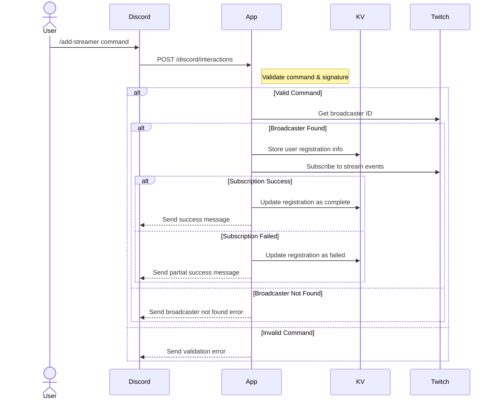
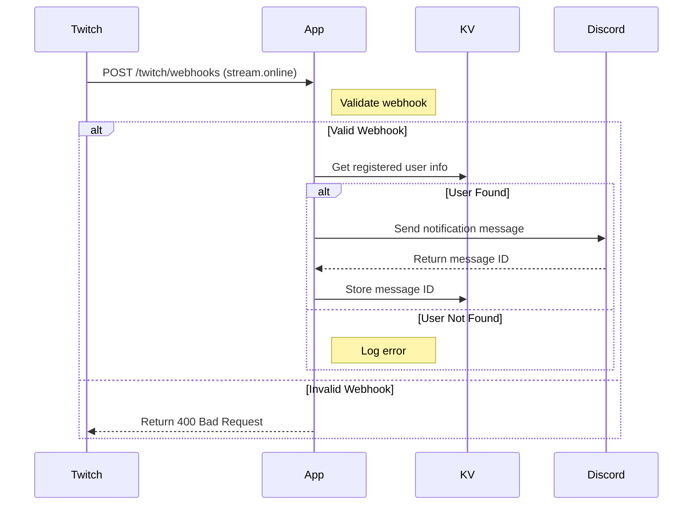

# Live-Noti-Fire

Twitchの配信開始/終了をDiscordで通知するBotです。

## Features

- サーバーへのBot追加時に自動でコマンドを登録
- `/add-streamer` コマンドでTwitchアカウントとDiscordアカウントを連携
- `/notify-settings` コマンドで通知チャンネルと通知ルールを設定
- 配信開始時に自動で通知メッセージを送信
- 配信終了時にメッセージにリアクションを追加

## Setup

### Prerequisites

- [Node.js](https://nodejs.org/) 22 or later
- [pnpm](https://pnpm.io/)
- [Cloudflare アカウント](https://dash.cloudflare.com/sign-up)（Workers + KV を使用）
- Discord Bot Application
- Twitch Developer Application

### Discord Bot Setup

1. [Discord Developer Portal](https://discord.com/developers/applications)でアプリケーションを作成

2. Botの設定
- 「Bot」タブで以下の設定を有効化：
  - `Presence Intent` 
  - `Server Members Intent`
  - `Message Content Intent`

3. Botをサーバーに追加
Discord Developer Portalの「OAuth2 > URL Generator」で `bot` と `applications.commands` スコープを選択し、必要な権限（メッセージ送信、リアクション追加）を付与したURLを生成して、自分のサーバーに招待してください。

ボットの追加時に自動的にスラッシュコマンドが登録されます。

必要な権限:
- メッセージの送信
- メッセージへのリアクション追加

### Twitch Setup

1. [Twitch Developer Console](https://dev.twitch.tv/console)でアプリケーションを作成
2. Client IDとClient Secretを取得

### Cloudflare KV の準備

本番用のKV namespaceを作成し、発行された`id`を`wrangler.toml`の`kv_namespaces`セクションに設定してください。

```bash
pnpm exec wrangler kv namespace create KV
```

### 環境変数の設定

ローカル開発（`wrangler dev`）では`.env`ファイルから環境変数が読み込まれます。本番環境（デプロイ後のWorker）では`wrangler secret put`で設定した値がバインディング経由で渡されます。`.env`ファイルはGitリポジトリにコミットしないでください。

1. .envファイルの作成
```bash
cp .env.example .env
```

2. .envファイルを編集（必要な値は`.env.example`を参照）

3. 本番用シークレットの設定（デプロイ前に一度だけ）

`.env`の値をまとめて本番に反映するスクリプトを用意しています（`wrangler secret bulk`のラッパー）：

```bash
pnpm run sync-secrets
```

1個ずつ設定したい場合は個別に`wrangler secret put <NAME>`も使えます：
```bash
pnpm exec wrangler secret put DISCORD_CLIENT_ID
# ...(DISCORD_CLIENT_SECRET, DISCORD_BOT_TOKEN, DISCORD_PUBLIC_KEY,
#     TWITCH_CLIENT_ID, TWITCH_CLIENT_SECRET, TWITCH_SUBSCRIPTION_SECRET,
#     X_CONSUMER_KEY, X_CONSUMER_SECRET, X_ACCESS_TOKEN, X_ACCESS_SECRET,
#     X_TARGET_TWITCH_ID も同様に)
```

`X_POST_PREFIX`・`DISCORD_ALLOWED_GUILD_IDS`・`TWITCH_CALLBACK_URL`のような非シークレットの設定値は`wrangler.toml`の`[vars]`セクションで管理するため、`sync-secrets`の対象外です。

### Development

1. リポジトリのクローン
```bash
git clone https://github.com/YourUsername/live-noti-fire.git
cd live-noti-fire
```

2. 依存関係のインストール
```bash
pnpm install
```

3. 環境変数の設定
```bash
cp .env.example .env
# .envファイルを編集して必要な値を設定
```

4. 開発サーバーの起動（[Cloudflare Workers](https://developers.cloudflare.com/workers/)をローカルでエミュレート）
```bash
pnpm exec wrangler dev
```

5. デプロイ
```bash
pnpm exec wrangler deploy
```

### Testing

[Vitest](https://vitest.dev/) + [@cloudflare/vitest-pool-workers](https://developers.cloudflare.com/workers/testing/vitest-integration/) を使用し、実際のWorkersランタイム（Miniflare）上でテストを実行します。

```bash
pnpm test        # 一度だけ実行
pnpm test:watch  # ウォッチモード
pnpm typecheck   # 型チェック
```

## Available Commands
### /add-streamer

Twitchアカウントの配信通知を登録します。

```
/add-streamer twitch_username:あなたのTwitchユーザー名
```

### /notify-settings

配信通知の設定を行います。

```
/notify-settings channel:通知を送信するチャンネル rules:通知ルール（オプション）
```

- `channel`: 通知を送信するDiscordチャンネル（必須）
- `rules`: 通知ルール（カンマ区切りで複数指定可、オプション）


## API Endpoints

### Discord Endpoints
```
POST /discord/interactions
```
Discordのスラッシュコマンドやインタラクションを受け付けます。

```
POST /discord/command_register
```
スラッシュコマンドを登録します。

### Twitch Endpoint
```
POST /twitch/webhooks
```
Twitchからのウェブフックを受け付けます。

(デバッグエンドポイントはセキュリティのため無効化されています)

### Health Endpoint
```
GET /health
```
サーバーの稼働状態を確認します。

## 補足情報

### スラッシュコマンドの手動登録

通常はBotのサーバー追加時に自動登録されますが、必要な場合は以下のコマンドで手動登録が可能です（ローカルの`.env`からDiscordの認証情報を読み込みます。デプロイ済みWorkerには影響しません）：

```bash
pnpm run register-commands
```

### KVクリーンアップ（不正利用ギルドの除去など）

インシデント対応用のスクリプトです。デフォルトではローカルKV（`wrangler dev`用の永続化ストア）に対して実行され、`--remote`を付けると本番KVに対して実行されます。

```bash
pnpm run cleanup-kv            # ローカルKV
pnpm run cleanup-kv -- --remote # 本番KV（要 wrangler login）
```

## Sequence Diagrams

### 1. Initial Registration Flow

```mermaid
sequenceDiagram
    actor User
    participant Discord
    participant App
    participant KV
    participant Twitch

    User->>Discord: /add-streamer command
    Discord->>App: POST /discord/interactions
    Note right of App: Validate command & signature

    alt Valid Command
        App->>Twitch: Get broadcaster ID

        alt Broadcaster Found
            App->>KV: Store user registration info
            App->>Twitch: Subscribe to stream events

            alt Subscription Success
                App->>KV: Update registration as complete
                App-->>Discord: Send success message
            else Subscription Failed
                App->>KV: Update registration as failed
                App-->>Discord: Send partial success message
            end

        else Broadcaster Not Found
            App-->>Discord: Send broadcaster not found error
        end

    else Invalid Command
        App-->>Discord: Send validation error
    end
```

### 2. Stream Start Flow

```mermaid
sequenceDiagram
    participant Twitch
    participant App
    participant KV
    participant Discord

    Twitch->>App: POST /twitch/webhooks (stream.online)
    Note right of App: Validate webhook

    alt Valid Webhook
        App->>KV: Get registered user info

        alt User Found
            App->>Discord: Send notification message
            Discord-->>App: Return message ID
            App->>KV: Store message ID
        else User Not Found
            Note right of App: Log error
        end

    else Invalid Webhook
        App-->>Twitch: Return 400 Bad Request
    end
```

### 3. Stream End Flow
```mermaid
sequenceDiagram
    participant Twitch
    participant App
    participant KV
    participant Discord

    Twitch->>App: POST /twitch/webhooks (stream.offline)
    Note right of App: Validate webhook

    alt Valid Webhook
        App->>KV: Get message ID & user info

        alt Found Message ID
            App->>Discord: Add end-stream reaction
            alt Reaction Success
                Note right of App: Complete
            else Reaction Failed
                Note right of App: Log error
            end
        else Not Found
            Note right of App: Log error
        end

    else Invalid Webhook
        App-->>Twitch: Return 400 Bad Request
    end
